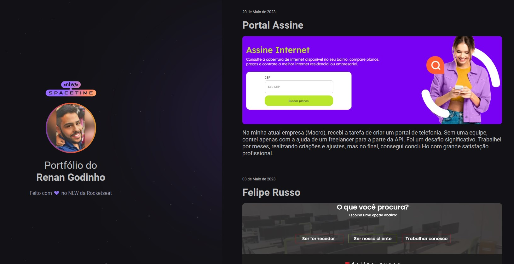

  

# 🖥️ Projeto

  Esse é um projeto Web Responsivo de uma cápsula do tempo para exibir memórias em uma linha do tempo, porém utilizei como portfólio dos meus projetos.

## 🚀 Tecnologias

 Esse projeto foi desenvolvido durante o NLW da Rocketseat com as seguintes tecnologias: 
 
 
  
  

